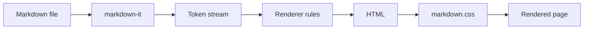
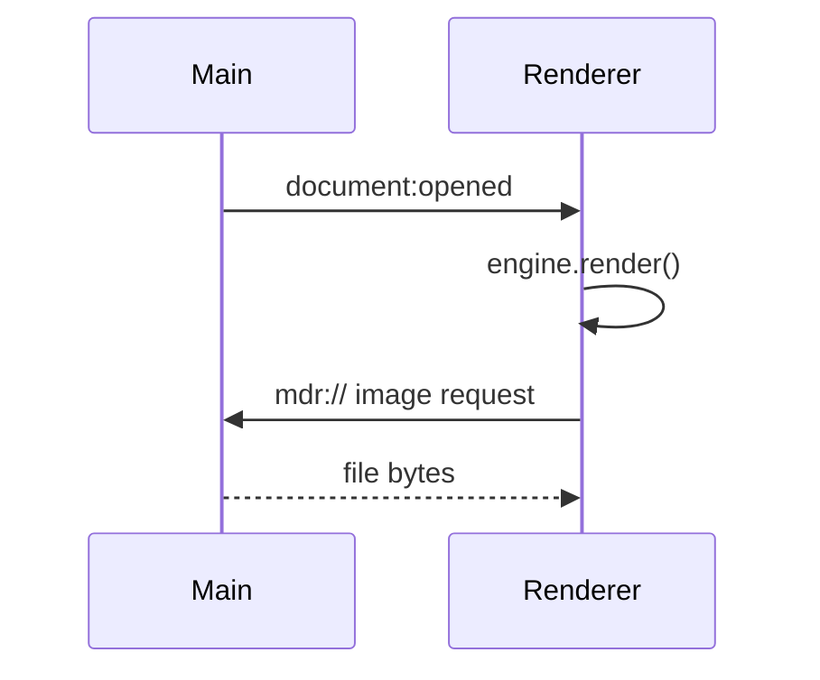

# MarkReader Kitchen Sink

This document exercises every feature ported from VS Code's Markdown preview.

## Inline formatting

Regular text with **bold**, *italic*, ***both***, ~~strikethrough~~, `inline code`,
a [external link](https://code.visualstudio.com), and an [in-page link](#tables).

Superscript x^2^ is not standard, but H~2~O sub/sup won't break layout either.

Line one with two trailing spaces  
forces a hard break above.

## Lists

1. First ordered item
2. Second ordered item
   1. Nested ordered
   2. Another nested
3. Third

- Unordered
- With nesting
  - Level two
    - Level three

### Task lists

- [x] Port the markdown engine
- [x] Port the stylesheet
- [ ] Ship a packaged installer
- [ ] Write more tests

## Tables

| Feature | Source file | Lines |
| --- | --- | ---: |
| Engine | `markdownEngine.ts` | 443 |
| Slugs | `slugify.ts` | 88 |
| Front matter | `yamlPreamble.ts` | 206 |
| Document CSS | `markdown.css` | 542 |
| Highlight CSS | `highlight.css` | 191 |

## Code blocks

TypeScript, to check highlight.js and the copy button:

```typescript
export class MarkdownItEngine {
	#md?: MarkdownIt;

	public render(text: string, context: RenderContext = {}): RenderOutput {
		const config = getMarkdownItConfig();
		const engine = this.#getEngine(config);
		return { html: engine.render(text), containingImages: new Set(), headings: [] };
	}
}
```

A language alias VS Code normalizes (`c#` becomes `cs`):

```c#
public class Program {
	static void Main(string[] args) => Console.WriteLine("Hello");
}
```

And one with no language at all:

```
plain preformatted text
	with a tab indent
```

## Math

Inline math: the Euler identity is $e^{i\pi} + 1 = 0$.

Display math:

$$
\int_{-\infty}^{\infty} e^{-x^2} \, dx = \sqrt{\pi}
$$

$$
\begin{aligned}
\nabla \cdot \mathbf{E} &= \frac{\rho}{\varepsilon_0} \\
\nabla \cdot \mathbf{B} &= 0 \\
\nabla \times \mathbf{E} &= -\frac{\partial \mathbf{B}}{\partial t}
\end{aligned}
$$

## Mermaid





A deliberately broken diagram, to confirm the error path degrades gracefully:

```mermaid
graph LR
    A -->
```

## Blockquotes

> A blockquote, which VS Code styles with a left border and tinted background.
>
> > Nested, to check the border stacking.

## Horizontal rule

---

## Images

A relative image reference, resolved through the `mdr://` protocol:


A missing image, which should simply not render:


## HTML passthrough

<div align="center">
  <strong>Raw HTML is enabled</strong>, matching VS Code's <code>html: true</code>.
</div>

## Long heading chain for the outline

### Level three A

Content.

### Level three B

Content.

#### Level four

Content.

##### Level five

Content.

###### Level six

Content.

## Duplicate heading

Content.

## Duplicate heading

The slugifier appends a counter, so both entries in the outline resolve correctly.
